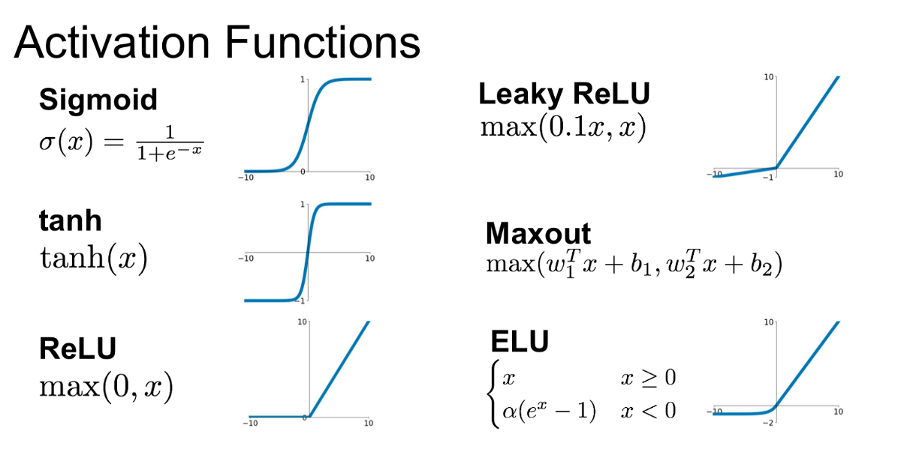

# Deep-learning Overview
##Constructing, training and tuning multi-layer perceptrons
### Back propogation
- take error we calculated at end of network and back propagate to tune weights in each connection.
- The gradient descent with reverse-mode autodiff used to perform backprogation
- How it works:
    - for each training step:
        - Compute  the output error
        - compute how much each neuron in the previous hidden layer contributed
        - back-propogate that error in a reverse pass
        - Tweak weights to reduce the error using gradient descent
### Activation functions (rectifier)
- The function that determine the output of the neuron given some of it's input
- Step functions don't work with gradient descent because there is no gradient! There is no slop
- Alternatives:
    - logistic function
    - hyperbolic tangent function
    - Exponential linear unit(ELU)
    - ReLU function (Rectified Linear Unit): 
      ReLU is common. Fast to compute and work wells.  There are ReLU variants are `Leaky ReLU` or `Noise ReLU` 
      
### Optimisation functions
Gradient descent is the preferred way to optimize neural networks and many other
machine learning algorithms and they are often embedded in libraries/tools.
- Batch gradient descent
- Stochastic gradient descent
- Mini-batch gradient descent
There are other popular gradient-based optimization algorithms such as Momentum, Adagrad, and Adam actually work.
- The standard method used to train mode is gradient descent 
- however, there are faster learning optimisers that gradient descent
    - Momentum Optimisation:
        - Introduce momentum term to the descent, so it slows down as curve start
to flatten and speeds up as the slope is steep
    - Nesterov Accelerated Gradient:
        - Tweak on momentum optimisation - computes momentum based on the gradient slightly
    ahead of you, not where you are
    - RMSProp:
        - Adaptive learning rate to help point toward the minimum. It sophisticated way to 
      find right direction to minimise error
    - Adam:
        - Adaptive moment estimation - momentum + RMSProp combined
        - Popular choice today, easy to use
    - AdaMax
    - Nadam
    - AMSGrad
    
### Avoid Overfitting 
When you start adding layers and neuron in a neural networks, number of weights starts adding up. 
With thousands of weights to tune, overfitting is a problem. There are ways to deal with it
- Early stopping, when performance starts dropping
- Regularisation terms added to cost function during training
- Dropout - which works very well. It ignore says 50% of neurons randomly at each training step. Forces your 
model to spread our it's learning
  
### Tuning your topology of network
- Trial an error
    - Evaluate a smaller network with less neurons in the hidden layers
    - Evaluate a larger network with more layers
        - try reducing the size of each layer as you progress, make funnel like structure
- More layers can yield faster learning
- Use more lauers and neurons than you need and dont care. But then you use early stopping
- Use model zoos - pretrained neural network models

    