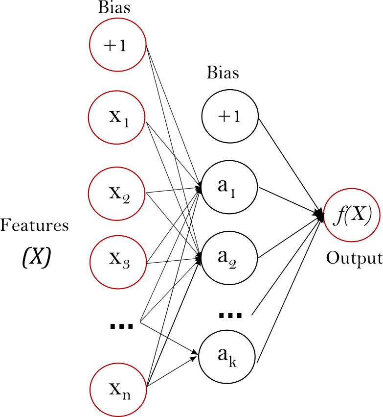

# Tensorflow
It is not specifically developed for neural networks. It is more generally an architecture for 
executing a graph of numerical operations. It actually distributes a process across GPU/CPU/ computing units
across network by looking at graph. It can run varieties of devices (phone/car/computer..etc).
It developed in C++ but easy to use using python API's. It's free and made by google.
It is very popular tool.

## Installation
conda install tensorflow
conda install tensorflow-gpu

## How to use it
`import tensorflow as tf`

Tensor: set of numbers such as vector or array

It don't actually execute right away. You give command at end so that it look at graph and 
optimise and distribute computation across the computing resource available in network/system.

Simple example is just add two numbers:
```
    import tensorflow as tf
    a = tf.Variable(1,name="a")
    a = tf.Variable(2,name="b")
    f = a + b
    
    tf.print(f)
```

Nothing happen action happen until command ``tf.print(f)``

## Extending idea to Neural network
Tensorflow is not just made for neural networks. 

Mathematical insights:
 - All those interconnected arrows multiplying weights can be thought of as a big matrix
multiplication, and the bias term can just be added onto the result of that matrix multiplication
```output = tf.matmul(previous_layer,layer_weights) + layer_biases```
   
There are higher level APIs to do this directly.

## Create complete neural network with tensorflow
- load train and test data
- construct graph to describe neural network topology
- associate optimiser (gradient descent) to the network
- run the optimiser with your training data
- evaluate your trained network with your test data

Note:
- when you are using neural networks make sure that your data is normalised. The goal is that every
  feature is comparable in terms of magnitude.
      -   0 mean and unit variance
- ``scikit_learn's`` StandardScalar can do this for you


